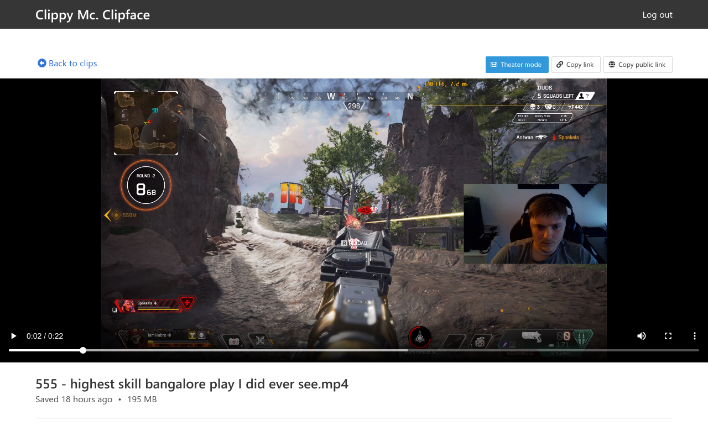
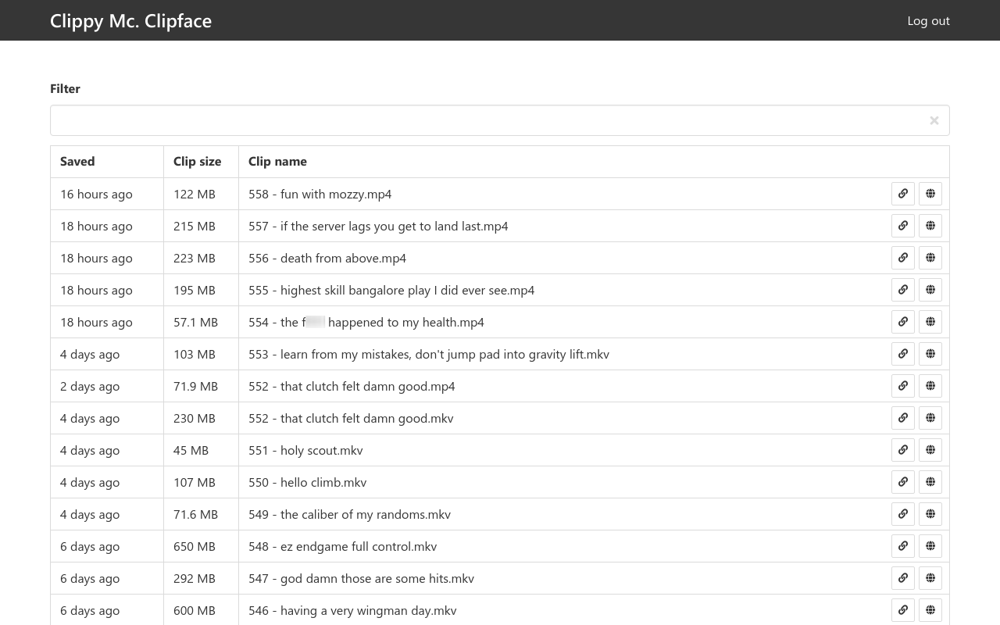

# Clippy Mc. Clipface

Super simple, self hosted clip sharing application.

## Features

- Simple, intuitive user interface
- No config required, hosts your existing clip folder
- Super simple deployement with official Docker image
- Simple but informative clip list with real time search
- Optional authentication to protect your clips
- "Copy public link" for copying clip links that circumvents user
  authentication for a single clip
- Implements OpenGraph metadata so videos are automatically embedded in
  Facebook posts, Discord messages etc.





## Usage with Docker

First of all pull the Docker image:

```
$ docker pull tomsan/clipface
```

Very simple usage, no authentication, port 80:

```
docker run -d \
  --name clipface \
  -v /host/path/to/clips:/clips \
  -p 80:80 \
  tomsan/clipface:latest
```

For more advanced usage, you need to provide Clipface with some
configuration. (See [Configuration](#configuration).) Here is an example
where we require authentication and set the clip list page title to "Bob's
clips":

```
docker run -d \
  --name clipface \
  -v /host/path/to/clips:/clips \
  -p 80:80 \
  -e CLIPFACE_USER_PASSWORD="password123" \
  -e CLIPFACE_CLIPS_PAGE_TITLE="Bob's clips" \
  tomsan/clipface:latest
```

## Configuration

Clipface uses [node-config](https://github.com/lorenwest/node-config) for
configuration management. This means that Clipface can be configured using a
config file or by setting environment variables (or both.) For Docker
deployments, using environment variables is the most convenient option.

If you would rather use a config file than environment variables, you can
use [config/default.toml](config/default.toml) as a reference. Mount the
resulting file to `/config/local.toml` inside the container. Any setting you
put in your config file will override the corresponding setting from the
default config file. If you want to leave a parameter at its default value,
simply omit it from your config file.

List of config parameters:

- `clips_path` - The absolute path of the directory containing the clips
  that Clipface should host. This defaults to `"/clips"`, which is a
  convenient value for Docker images.

  **Default value**: `"/clips"`  
  **Environment variable**: `CLIPFACE_CLIPS_PATH`

- `user_password` - A password used to protect this Clipface instance. If
  set, users must input this password before they can watch any clips or see
  the list of clips. By default this parameter is not set, which will allow
  anybody to browse and watch all your clips.

  **Default value**: *(unset)*  
  **Environment variable**: `CLIPFACE_USER_PASSWORD`

- `secure_cookies` - If set to true (which is the default value), the
  "secure" setting will be used for the authication cookie, which means the
  cookie will only be included when using SSL (HTTPS). If you are not using
  SSL, you need to set this option to false, or authentication won't work.

  **Default value**: `true`  
  **Environment variable**: `CLIPFACE_SECURE_COOKIES`

- `clips_page_title` - Title displayed on the clip list page

  If not set (which is the default), no title will be displayed and the
  header will be significantly smaller.

  **Default value**: *(unset)*  
  **Environment variable**: `CLIPFACE_CLIPS_PAGE_TITLE`

## NGINX reverse proxy with SSL

For the best security, you should run Clipface behind a SSL-enabled reverse
proxy, especially if you are using authentication. Otherwise, passwords will
be transferred in plain text over the internet, which is always a bad idea.

Here is an example NGINX configuration that uses certificates from Let's
Encrypt:

```nginx
server {
    listen 443 ssl http2;
    listen [::]:443 ssl http2;
    server_name my-clipface-domain.com;

    ssl_certificate /etc/letsencrypt/live/my-clipface-domain.com/fullchain.pem;
    ssl_certificate_key /etc/letsencrypt/live/my-clipface-domain.com/privkey.pem;

    # SSL config below generated by: ssl-config.mozilla.org

    ssl_session_timeout 1d;
    ssl_session_cache shared:MozSSL:10m;  # about 40000 sessions
    ssl_session_tickets off;

    ssl_dhparam dhparam.pem;

    # Intermediate configuration
    ssl_protocols TLSv1.2 TLSv1.3;
    ssl_ciphers ECDHE-ECDSA-AES128-GCM-SHA256:ECDHE-RSA-AES128-GCM-SHA256:ECDHE-ECDSA-AES256-GCM-SHA384:ECDHE-RSA-AES256-GCM-SHA384:ECDHE-ECDSA-CHACHA20-POLY1305:ECDHE-RSA-CHACHA20-POLY1305:DHE-RSA-AES128-GCM-SHA256:DHE-RSA-AES256-GCM-SHA384;
    ssl_prefer_server_ciphers off;

    # HSTS (ngx_http_headers_module is required) (63072000 seconds)
    add_header Strict-Transport-Security "max-age=63072000" always;

    # OCSP stapling
    ssl_stapling on;
    ssl_stapling_verify on;

    # Replace with the IP address of your resolver
    resolver 1.1.1.1 1.1.2.2;

    location / {
        proxy_pass http://clipface/;
        proxy_set_header X-Forwarded-Host $host;
        proxy_set_header X-Forwarded-Proto $scheme;
        proxy_connect_timeout 3s;
        proxy_send_timeout 10s;
        proxy_read_timeout 300s;
        client_max_body_size 100m;
    }
}
```

You must replace the URL in `proxy_pass http://clipface/` with your local
Clipface address, for example `http://127.0.0.1:3000`. In my case I'm
running both Clipface and NGINX as Docker containers in the same Docker
network, so I'm simply referring to Clipface by its container name,
"clipface".

**NB:** The "X-Forwarded-\*" headers are required for the server to know its
own URL, which is needed for certain server-side rendered meta tags. If you
don't configure these headers, things like embedding Discord videos will
fail.

**NB:** This config assumes you have the file "dhparam.pem" in your NGINX
root config directory. If you don't, you can generate it like this: `openssl
dhparam -out /my/nginx/config/path/dhparam.pem 2048`.

**NB:** The `Strict-Transport-Security` header informs browsers to always use
HTTPS towards your domain. This will break any HTTP (not HTTPS) applications
you are hosting on your domain, so enable with care.

## Authentication

Clipface supports simple password authentication by setting the
`user_password` option in the config file. This will redirect users to a
login screen where the configured password must be entered before the user
can proceed.

For security reasons, the hashed password is stored in a HTTP-only cookie.
Clipface assumes (again for security reasons) that you will be running it
behind a reverse proxy with SSL enabled, so the "secure_cookies" config
option defaults to `true`. This means that the authentication cookie is
created with the "secure" flag, which means it will only be transferred when
the HTTPS protocol is used. If you are running Clipface without SSL (not
using HTTPS), you should set the "secure_cookies" option to `false` in the
config file, otherwise authentication will not work. Be aware that passwords
will be transferred in plain text in this case.

If you see any issues or have any concerns about security, please [open an
issue on Github](https://github.com/Hubro/clipface/issues/new).

## Single clip tokens

Clipface will automatically generate single clip authentication tokens when
the "Copy public link" button is pressed. These tokens only allow access to
a single clip.

They are generated by hashing the clip name with the configured user
password (plus some salt). This means that all single clip auth tokens can
be invalidated by changing the user password. Single clip auth tokens for a
specific clip can be invalidated by renaming the clip.

## Roadmap

See [Clipface v2.0 tasks](https://github.com/Hubro/clipface/projects/1).
